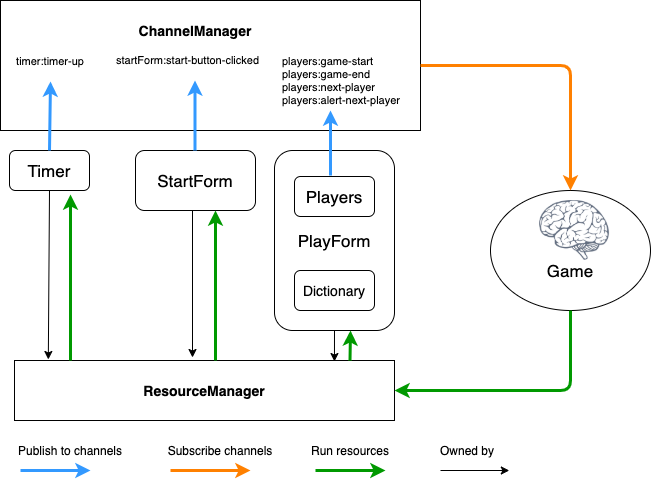

## Guess Game ##

You enter the number of players in the game and a list of words to the Dictionary before clicking Start. 
Player takes turn to input a list of words they guess in the Dictionary with a Timer ticking, they will score if the list of submitted words is all in the Dictionary.
The winners are the ones who score the most, it can be mulitple winners if they score the same. 

### Architecture ###
 